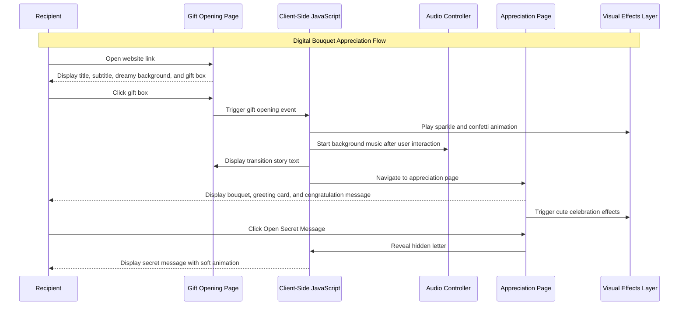
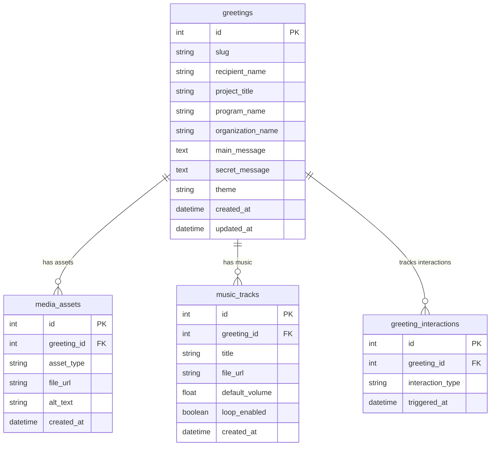

# PRD — For The Girl Who Made It 🌸

## 1. Overview

**For The Girl Who Made It 🌸** is a cute, dreamy, interactive appreciation website designed as a digital bouquet and greeting card experience for a girl who has successfully completed her first program as a **Chief Organizer**.

The website is created as an alternative to giving a physical flower bouquet. Instead of only sending a static message, the user will experience a two-page digital surprise: a cute gift-opening page followed by a personalized appreciation page containing a digital flower bouquet, heartfelt greeting card, soft background music, floating visual effects, and a hidden secret message.

The emotional purpose of this website is to celebrate the recipient’s successful completion of **SOS-TA**, short for **Sosialisasi Tugas Akhir**, a program under the **AKPRO Department** of **HIMASISFO**. The recipient completed this program as a new department member while also taking responsibility as the Chief Organizer.

The main message of the website is:

> “I saw how hard you worked, and I am proud of you.”

The project should not feel formal, corporate, or overly elegant. It should feel cute, dreamy, warm, cheerful, personal, and emotionally meaningful. The visual identity should use a pastel color palette based on **light pink, light cyan, and white**, supported by playful flower colors, sparkles, hearts, soft clouds, petals, and simple cute fireworks or confetti effects.

The website will be developed as a beginner-friendly static web project using simple frontend technologies. The first version does not require backend, authentication, database, dashboard, CMS, or admin panel.

## 2. Requirements

The following requirements define the expected behavior, scope, and constraints of the website.

* **Platform:**
  The website must be accessible through a modern web browser on mobile, tablet, and desktop devices.

* **Primary User:**
  The primary user is the recipient, who will open the website link and interact with the digital gift.

* **Website Structure:**
  The website must contain exactly two main pages:

  1. Gift Opening Page
  2. Appreciation Greeting Page

* **Theme Direction:**
  The website must follow a **Cute Dreamy Appreciation** theme, not a formal luxury theme.

* **Color Palette:**
  The primary colors must be:

  * Light Pink
  * Light Cyan
  * White

* **Emotional Context:**
  The website must celebrate the recipient’s success in completing SOS-TA as her first program as a Chief Organizer in AKPRO HIMASISFO.

* **Main Interaction:**
  On Page 1, the user must click a gift box to open the surprise and move to Page 2.

* **Music Behavior:**
  Background music should begin after the user clicks the gift box. This is necessary because most browsers block autoplay audio unless triggered by user interaction.

* **Visual Effects:**
  The website should include cute and lightweight visual effects such as:

  * floating petals;
  * sparkles;
  * hearts;
  * simple confetti;
  * cute mini-fireworks;
  * soft glowing transitions.

* **Greeting Card:**
  Page 2 must include a personal greeting card that appreciates the recipient’s effort, responsibility, growth, and successful completion of SOS-TA.

* **Digital Bouquet:**
  Page 2 must display a cute, colorful, cheerful digital bouquet as the central visual gift.

* **Hidden Message:**
  Page 2 should include an optional “Open Secret Message” interaction to reveal a more personal hidden letter.

* **Responsiveness:**
  The layout must prioritize mobile-first design because the recipient is likely to open the website from a phone.

* **Technical Simplicity:**
  The MVP should be implemented using static frontend technologies without backend complexity.

## 3. Core Features

The following features define the first version of the website.

1. **Gift Opening Page**

   * Displays the project title: **For The Girl Who Made It 🌸**.
   * Shows a short subtitle such as:

     * “A little surprise for someone who worked really hard ✨”
   * Displays a cute pastel gift box in the center of the screen.
   * Uses a dreamy background with light pink, light cyan, white, clouds, sparkles, and floating petals.
   * Allows the user to click the gift box to open the surprise.

2. **Gift Box Interaction**

   * The gift box should have a subtle idle animation, such as floating, bouncing, glowing, or gently shaking.
   * On click, the gift box should trigger:

     * sparkle burst;
     * soft confetti;
     * short transition animation;
     * background music initialization;
     * navigation to Page 2.

3. **Transition Story**

   * After clicking the gift box, the website should briefly display emotional transition text before or during navigation.
   * Suggested transition lines:

     * “There was a girl...”
     * “Who accepted a challenge.”
     * “Who took responsibility.”
     * “Who led her very first program.”
     * “SOS-TA.”
     * “And despite all the pressure...”
     * “She made it. 🌸”
   * The transition should be short enough to remain smooth and not delay the experience too long.

4. **Appreciation Greeting Page**

   * Displays a congratulatory hero message:

     * “Congratulations 🌸”
   * Displays a subtitle:

     * “Your first SOS-TA has finally come to an end. And you did an amazing job.”
   * Shows a central cute digital flower bouquet.
   * Shows the greeting card below or beside the bouquet depending on screen size.
   * Plays soft background music after the first user interaction.

5. **Digital Bouquet**

   * The bouquet should feel cute, cheerful, and colorful.
   * Recommended flower composition:

     * Pink Peonies
     * White Daisies
     * Blue Hydrangeas
     * Tulips
     * Baby’s Breath
   * The bouquet should use a bright pastel composition:

     * 40% light pink
     * 20% white
     * 20% light cyan or soft blue
     * 10% lavender
     * 10% soft yellow or peach accents

6. **Greeting Card**

   * Displays a heartfelt appreciation message.
   * The message should focus on:

     * her first leadership experience;
     * her responsibility as Chief Organizer;
     * her effort as a new AKPRO member;
     * the completion of SOS-TA;
     * emotional appreciation and pride.
   * The card should use a soft, rounded, cute visual style with pastel shadows and playful decoration.

7. **Secret Message**

   * Provides a button labeled:

     * “💌 Open Secret Message”
   * When clicked, a hidden message appears with a soft animation.
   * The secret message should feel more personal and intimate than the main greeting card.
   * It should emphasize that her effort, tiredness, and persistence were noticed.

8. **Cute Celebration Effects**

   * Page 2 should display lightweight celebration effects when loaded.
   * Effects may include:

     * heart particles;
     * flower petals;
     * soft sparkle burst;
     * mini-fireworks;
     * confetti stars.
   * Effects should remain cute and subtle, not heavy or distracting.

9. **Music Control**

   * Provides simple music controls:

     * play;
     * pause;
     * mute or unmute.
   * Music should start only after the user interacts with the website.
   * Default volume should be low and gentle.

10. **Replay Interaction**

    * Provides an optional button:

      * “🎁 Open Again”
    * Allows the recipient to return to the gift opening page or replay the main animation.

## 4. User Flow

The expected user flow is as follows:

1. **Open Website Link**

   * The recipient opens the website link from a browser.
   * The website loads the Gift Opening Page.

2. **View Opening Screen**

   * The recipient sees the title:

     * “For The Girl Who Made It 🌸”
   * The recipient sees the subtitle:

     * “A little surprise for someone who worked really hard ✨”
   * The recipient sees a cute pastel gift box in the center of the screen.

3. **Click Gift Box**

   * The recipient clicks the gift box.
   * The gift box plays an opening animation.
   * Sparkles and confetti appear.
   * Background music is initialized.
   * The system begins the transition sequence.

4. **View Transition Story**

   * The website displays short emotional text lines.
   * The text introduces the meaning behind the surprise:

     * first program;
     * first leadership responsibility;
     * SOS-TA;
     * successful completion.

5. **Enter Appreciation Page**

   * The website navigates to the second page.
   * The recipient sees the congratulatory hero section.
   * Cute celebration effects appear.
   * Music continues playing softly.

6. **View Digital Bouquet**

   * The recipient sees a cheerful pastel flower bouquet.
   * The bouquet acts as the main digital gift.

7. **Read Greeting Card**

   * The recipient reads the appreciation card.
   * The card explains that her hard work, pressure, responsibility, and growth were noticed and appreciated.

8. **Open Secret Message**

   * The recipient clicks the secret message button.
   * A hidden personal message appears.
   * The message gives a warmer and more intimate expression of pride and support.

9. **Control Music or Replay**

   * The recipient can pause or resume the music.
   * The recipient can replay the gift-opening experience if the replay button is enabled.

## 5. Architecture

The website should use a simple static frontend architecture suitable for a beginner project. No backend is required for the MVP.



The technical architecture should be divided into the following layers:

1. **Presentation Layer**

   * Responsible for HTML structure and visual layout.
   * Contains Page 1 and Page 2.
   * Handles content sections such as title, subtitle, bouquet, greeting card, secret message, and buttons.

2. **Styling Layer**

   * Responsible for the cute dreamy visual identity.
   * Uses CSS for:

     * pastel gradient background;
     * responsive layout;
     * gift box styling;
     * card styling;
     * bouquet positioning;
     * animations;
     * shadows;
     * decorative elements.

3. **Interaction Layer**

   * Uses JavaScript to manage user interactions.
   * Handles:

     * gift box click;
     * page transition;
     * text animation;
     * secret message reveal;
     * replay button;
     * music controls.

4. **Visual Effects Layer**

   * Handles decorative animations.
   * May use CSS animations or lightweight JavaScript effects.
   * Recommended effects:

     * floating petals;
     * sparkle particles;
     * confetti;
     * cute mini-fireworks;
     * floating hearts.

5. **Audio Layer**

   * Handles background music playback.
   * Music should start only after user interaction.
   * Provides play, pause, mute, and unmute behavior.
   * Default volume should be gentle.

6. **Asset Layer**

   * Stores all static assets:

     * flower bouquet image;
     * gift box image or CSS illustration;
     * music file;
     * sparkle icons;
     * heart icons;
     * background decorations.

Recommended folder structure:

```text
for-the-girl-who-made-it/
│
├── index.html
├── greeting.html
│
├── css/
│   └── style.css
│
├── js/
│   ├── main.js
│   ├── transition.js
│   ├── effects.js
│   └── audio.js
│
├── assets/
│   ├── bouquet.png
│   ├── gift-box.png
│   ├── music.mp3
│   ├── petals.png
│   ├── sparkle.svg
│   └── heart.svg
│
└── README.md
```

## 6. Database Schema

This project does not require a database for the MVP because all content can be stored statically in HTML, CSS, JavaScript, and local assets.

However, if the project is expanded into a customizable greeting website generator in the future, the following database schema may be used.



| Table                     | Description                                                                                                             |
| ------------------------- | ----------------------------------------------------------------------------------------------------------------------- |
| **greetings**             | Stores personalized greeting data such as recipient name, project title, program name, main message, and secret message |
| **media_assets**          | Stores image or icon assets connected to a greeting page                                                                |
| **music_tracks**          | Stores background music configuration, including file URL, volume, and loop behavior                                    |
| **greeting_interactions** | Stores interaction logs such as gift opened, secret message opened, or replay clicked                                   |

For the MVP version, this schema should not be implemented. It is only provided as a future scalability option.

## 7. Design & Technical Constraints

This section defines the visual, technical, and content constraints for the project.

1. **Theme Constraint**

   * The website must use a **Cute Dreamy Appreciation** theme.
   * The design must not feel formal, corporate, or overly elegant.
   * The emotional tone should be warm, cheerful, soft, romantic, and personal.

2. **Color Palette**
   The primary color palette must use:

   * **Light Pink:** `#FFB6D9`
   * **Light Cyan:** `#AEEFFF`
   * **White:** `#FFFFFF`

   Supporting colors may include:

   * **Lavender:** `#E5D5FF`
   * **Pastel Peach:** `#FFD6B8`
   * **Soft Yellow:** `#FFF4B8`
   * **Mint:** `#D7FFE6`

   Accent colors may include:

   * **Hot Pink:** `#FF6FB5`
   * **Sky Blue:** `#5EDCFF`

3. **Flower Design Constraint**

   * Flowers must look cute, colorful, and cheerful.
   * The bouquet must not look like a formal wedding bouquet or corporate congratulation bouquet.
   * Recommended flower composition:

     * Pink Peonies
     * White Daisies
     * Blue Hydrangeas
     * Tulips
     * Baby’s Breath

4. **Typography Rules**
   The interface should use playful but readable typography. Recommended font configuration:

   * **Heading Font:** rounded, cute, and friendly display font
   * **Body Font:** clean sans-serif font for readability
   * **Fallback Sans:** `ui-sans-serif, system-ui, sans-serif`
   * **Fallback Mono:** `ui-monospace, SFMono-Regular, Menlo, monospace`

   Optional font direction:

   * Heading: `Baloo 2`, `Nunito`, or `Quicksand`
   * Body: `Nunito`, `Poppins`, or `Inter`

5. **Animation Constraint**

   * Animations must be soft, cute, and lightweight.
   * Avoid aggressive transitions, excessive flashing, or visually heavy fireworks.
   * Motion should feel playful and emotional, not chaotic.
   * Animation duration should be smooth and short enough to avoid making the recipient wait too long.

6. **Audio Constraint**

   * Music must not autoplay before user interaction.
   * Music should start after the gift box is clicked.
   * The website must provide a visible music control button.
   * Default volume should be low.
   * Recommended music style:

     * music box;
     * soft piano;
     * cute lofi;
     * gentle acoustic;
     * warm instrumental.

7. **Responsiveness Constraint**

   * The website must follow a mobile-first layout.
   * On mobile, content should be stacked vertically:

     * title;
     * gift box;
     * bouquet;
     * greeting card;
     * buttons.
   * On desktop, bouquet and greeting card may be placed side by side.

8. **Accessibility Constraint**

   * Images must include descriptive `alt` text.
   * Buttons must have clear labels.
   * Text contrast must remain readable on pastel backgrounds.
   * Audio controls must be accessible.
   * Animations should not block access to the main message.

9. **Technical Constraint**

   * MVP should use:

     * HTML
     * CSS
     * JavaScript
   * No backend is required.
   * No authentication is required.
   * No database is required.
   * No complex framework is required for the first version.
   * The project should be deployable on static hosting platforms such as Netlify, Vercel, or GitHub Pages.

10. **Content Constraint**

    * The writing must be personal and heartfelt.
    * The message must appreciate the recipient’s effort in completing SOS-TA.
    * The message must mention her role as Chief Organizer.
    * The message must acknowledge that she was a new member of AKPRO in HIMASISFO.
    * The message should avoid sounding too formal or generic.

11. **MVP Boundary**
    The MVP must include:

    * Page 1 gift opening screen;
    * Page 2 appreciation page;
    * digital bouquet;
    * greeting card;
    * simple animation effects;
    * background music;
    * secret message reveal;
    * responsive layout.

    The MVP must not include:

    * login system;
    * admin dashboard;
    * database;
    * payment system;
    * CMS;
    * real-time collaboration;
    * user analytics;
    * complex animation engine.

12. **Future Enhancements**
    Future versions may include:

    * customizable recipient name;
    * URL query personalization;
    * theme selector;
    * downloadable greeting card;
    * share button;
    * QR code generation;
    * multiple greeting templates;
    * animated envelope interaction;
    * flower meaning section;
    * personalized photo gallery.
